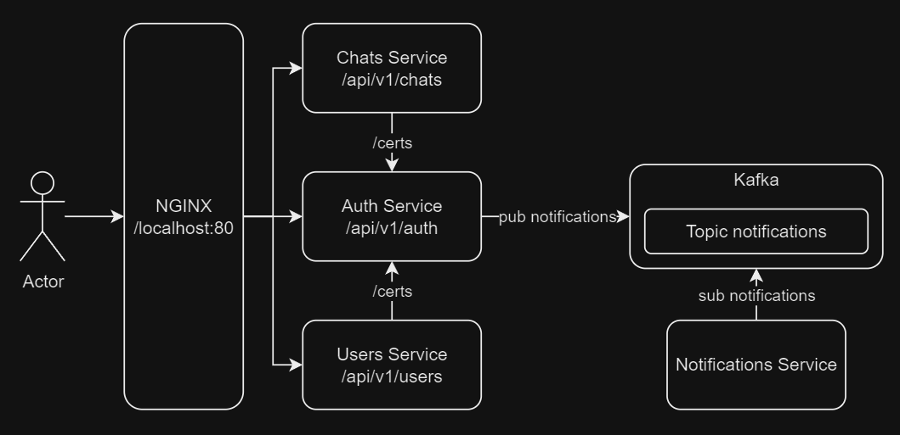

# Kafka Chat

## Feautures
* Microservice Architecture (Auth, Users, Chat, Notifications)
* Kafka Message Broker
* NGINX API Gateway
* JWT Token Auth (self-verification of the token using the  public key for each microservice)
* Email confirmation

## Architecture
